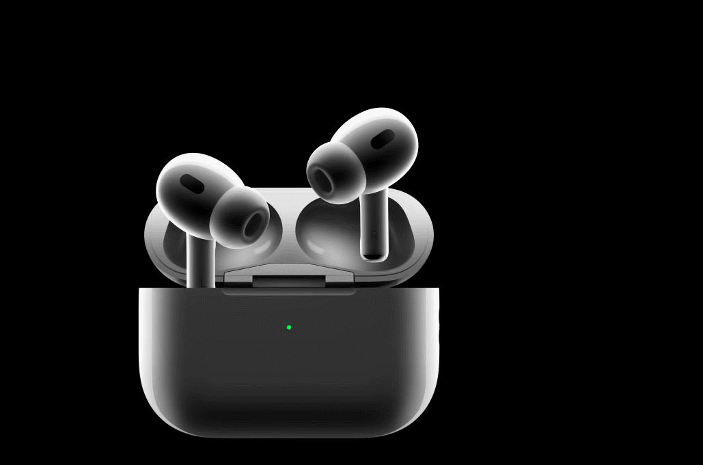
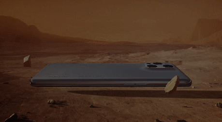
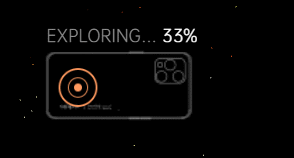
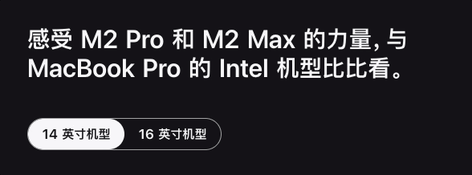

# nice-func

尝试实现一些让人耳目一新、感觉很 nice 的网页内容、动效

* [5. 苹果官网 AirPods 充电盒动效实现，根据滚动位置打开、收起、旋转等](#苹果官网 AirPods 充电盒动效实现，根据滚动位置打开、收起、旋转等)
* [4. iPhone14 新配色官网首屏动效实现](#iPhone14-新配色官网首屏动效实现)
* [3. OPPO Find X3 火星版官网：使用 GSAP 和 clip-path 实现 5 种场景切换动效](#find-x3-火星版官网动效实现)
* [2. MacBook Pro 新品发布官网动画效果实现(2023年01月)](#macbook-pro-新品发布官网动画效果实现2023年01月)
* [1. vivo iQOO Neo7 向下滚动切换手机颜色效果](#vivo-iqoo-neo7-向下滚动切换手机颜色效果)

## 5. 苹果官网 AirPods 充电盒动效实现，根据滚动位置打开、收起、旋转等

核心：Play video on scroll + 根据 video 播放位置，设置不同文案显示

来源：[AirPods Pro (第二代) - Apple (中国大陆)](https://www.apple.com.cn/airpods-pro/)



最开始是在研究 ipad mini 根据页面滚动旋转操作入坑。了解到是一个视频。根据滚动播放视频。


后面发现 AirPods Pro，之前老款的 Mac Pro 垃圾桶版也有类似的动画，先解决第一个问题，根据滚动播放视频

* 1、使用下载下来的 ipad mini webm 视频，不流畅、laggy（迟缓）
  * 最终，找到了 3 种实现方式
    * ① requestAnimationFrame mac pro垃圾桶 <https://codepen.io/marduklien/pen/MdvdEG>
    * ② 监听页面滚动 pause() 视频 <https://codepen.io/ksiddiqi/pen/YzRmBb>
    * ③ 使用 scrolly-video 开源库 <https://github.com/dkaoster/scrolly-video>
  * 奇怪的是使用别人 demo 中的视频滚动时切换流畅，但换到 ipad mini 这个 webm 视频就不行
  * 考虑是视频的问题
* 2、使用 FFmepg 设置关键帧间隔为 1，三种方式，都可以保持流畅。但 webm 转 mp4 透明背景会被转换为黑色无法去除

  ```js
  // if somebody needs a command to convert I frame only mp4(video with keyframe distance), please refer to the command below.

  ffmpeg -i original.mp4 -c:v libx264 -x264-params keyint=1 original_I.mp4

  // keyint是两个keyframe之间的最大距离，minkeyint是两个 keyframe之间的最小距离。

  // 什么是视频关键帧距？ // https://www.jianshu.com/p/1a6b2bff5876
  // 关键帧距离值会告诉编码器有关重新评估视频图像，以及将完整帧或关键帧录制到文件中的频率。
  // 如果画面包含大量场景变换或迅速移动的动作或动画，那么减少关键帧距离将会提高图像的整体品质。
  // 一个较小的关键帧距离对应于一个较大的输出文件。
  ```

  * 参考：Why it's laggy when is scroll up <https://github.com/dkaoster/scrolly-video/issues/36>
  * webm 支持透明背景，mp4 不支持透明背景，因此转换后透明背景被转黑色
* 3、使用 Honeycam 将黑色背景替换为白色背景，有黑色噪点，非透明
* 4、使用 Captura 录制白色背景视频，滚动切换帧流畅，但比官网模糊、非透明(设置 #f5f5f7 背景视频大部分还是白色)
* 5、回到 1，把 ipad mini 官网 webm 视频拿出来，看怎么将 webm 设置关键帧距离为 1，且保持 webm 透明背景？
  * 暂时无解

```js
// 视频播放时长、视频当前播放位置
// select video element
var vid = document.getElementById('vid');
window.onscroll = function(){
    console.log(vid.duration ); //获取视频时长
    console.log(vid.currentTime); //获取视频当前播放时间
};
```

经过测试，发现 AirPods 下面的视频比较流程，于是选中了 AirPods 充电盒动效作为主题

上面有三种方式实现在滚动时切换视频，由于我们需要在滚动的时候，根据视频播放位置显示不同的文案，这里监听视频播放位置，再做处理

```js
vid.addEventListener("timeupdate", (e) => {
  // 0 - 2s 充电盒关闭，隐藏底部文案
  // 2 - 3s 充电盒旋转到侧面，显示充电盒侧面文案
  // 3 - 4s 充电盒旋转到底部，隐藏侧面文案
  // 4 - 4.5s 显示底部文案
  // 4.5. - 5s 充电盒位置回正，显示底部文案
  console.log(e.target.currentTime);
  let t = e.target.currentTime;

  // step-1
  if (t < 0.2) {
    document.querySelector(".step-1").classList.add("active");
  } else {
    document.querySelector(".step-1").classList.remove("active");
  }

  // step-2
  if (t > 2 && t < 3.2) {
    document.querySelector(".step-2").classList.add("active");
    // 精确控制宽度显示
    // 1s 间隔, 宽度 0 => 429；1s = 429、(t - 2)s = (t - 2) * 429
    //          top  50 => 0; 1s = 0、 (t - 2)s =
    // document.querySelector(".step-2 .line").style.clipPath = `inset(0 0 0 ${(3 - t) * 100}%)`
  } else {
    document.querySelector(".step-2").classList.remove("active");
  }
})
```

参考：

* [AirPods的正确读法](https://www.bilibili.com/video/BV1TV41167H9)

## 4. iPhone14 新配色官网首屏动效实现

核心 transform: matrix /ˈmeɪtrɪks/

来源：[iPhone 14 和 iPhone 14 Plus - Apple (中国大陆)](https://www.apple.com.cn/iphone-14/)


```js
// 图片间距，靠 scale: 56% 这种缩放做出来的
// 图片白色边框去除，使用 mask-image

// focus 黄色 iphone 时，父元素样式
transform: matrix(1.04327, -0.464493, 0.464493, 1.04327, -768.586, 130.872);
// transform matrix重点解析 https://zhuanlan.zhihu.com/p/74279787
// rotate、scale、translate 3 个矩阵相乘，得到上面的 matrix 的 6 个参数
transform: rotate(-24deg) scale(1.142) translate(-661px, -170px);
// 由于 matrix 结果很难逆向，使用手动方式，测试出对应的角度，偏移具体值。

transform: matrix(0.86, 0, 0, 0.86, 0, 0);
// 对应矩阵如下，等价于 scale(0.86, 0.86):
0.86 0 0
0 0.86 0
0 0 1

transform: matrix(1, 0, 0, 1, 0, -2480.12);
// translateY(Y):
1 0 0
0 1 -2480.12
0 0 1
```

```js
// 紫色 matrix 逆向
transform: matrix(1.3532, -0.192071, 0.192071, 1.3532, -649.839, 140.245);
transform: scale(1.38) translate(-462px, 95px) rotate(-9deg); // 手工测试
// 1、应用该样式，记录元素宽高，再通过设置 scale 调整达到对应宽高，得到 scale(x) 值
// 2、观察 iphone 角度，得到 rotate  
// 3、根据位置得到 x, y 偏移

// 根据 mdn 文档来看 https://developer.mozilla.org/en-US/docs/Web/CSS/transform-function/matrix
transform: matrix(scaleX(), skewY(), skewX(), scaleY(), translateX(), translateY())
// 尝试转换 purple 位置，发现有偏差，还是按照之前的手动还原来还原值
transform: matrix(1.3532, -0.192071, 0.192071, 1.3532, -649.839, 140.245);
transform: scale(1.3532) skewY(-0.192071deg) skewX(0.192071deg) translate(-649.839px, 140.245px);

// 蓝色
transform: matrix(1.60574, 0.269279, -0.269279, 1.60574, -510.662, 196.845);
transform: scale(1.619) rotate(10deg) translate(-302px, 173px);
// 红色
transform: matrix(1.64561, 0.755092, -0.755092, 1.64561, -364.436, 307.051);
transform: scale(1.811) rotate(24deg) translate(-120px, 241px);
```

进入页面后动画

```js
const colorsMap = {
  midnight: "午夜色",
  starlight: "星光色",
  red: "红色",
  blue: "蓝色",
  purple: "紫色",
  yellow:  "黄色"
};

window.addEventListener('load', async () => {
  // 页面加载完成后，逐一显示 iphone 图片
  for (let color in colorsMap) {
    console.log('start')
    // await new Promise((resolve, reject) => {
    //   setTimeout(() => {
    //     resolve()
    //   }, 50)
    // })
    await new Promise((r) => setTimeout(r, 50))
    console.log(color)
    document.querySelector(`.iphone-images .${color}`).style.opacity = '1';
  }
  await new Promise((r) => setTimeout(r, 500)) // 停留 0.5s
  document.querySelector('#yellow').click() // focus 到黄色
  document.querySelector('.new-style').style.display = 'block'; // 显示新款文案
})
```

切换颜色

```js
// 当 colors 点击，如果是 span 元素
// 现将所有的 label 上的 active 移除。在将其 parent 节点加上 active
document.querySelector('.colors').addEventListener('click', (e) => {
  if (e.target.nodeName === 'SPAN') {
    // 处理右上角颜色切换
    document.querySelectorAll('.colors label').forEach(item => {
      item.classList.remove('active')
    })
    e.target.parentNode.classList.add('active')
    document.querySelector('#color-text').innerText = colorsMap[e.target.id]

    // 中间图片 active 处理
    document.querySelectorAll('.iphone-images figure').forEach(item => {
      item.classList.remove('active')
    })
    let curImg = document.querySelector(`.iphone-images .${e.target.id}`)
    curImg.classList.add('active')
    // 给图片的父元素增加自定义属性值
    document.querySelector(`.iphone-images`).dataset.active = e.target.id
  }
})
```

## 3. Find X3 火星版官网动效实现

使用 GSAP 和 clip-path 实现 5 种场景切换动效

来源：[OPPO Find X3 Pro 火星探索版 有色彩的地方 就有让生命感动的力量 | OPPO 官方网站](https://www.oppo.com/cn/smartphones/series-find-x/find-x3-pro-mars/)



1、首屏是一个 video 动画，没有加 loop，比较简单

2、第二屏也是一个 video 视频，加了鼠标样式，文字动画

修改鼠标样式代码如下

```js
/*
<div class="section-2" style="width: 100%">
  <video src="xxx" muted autoplay loop style="width: 100%" ></video>
  <!-- @鼠标样式_start -->
  <div class="player-btn">
      <div>鼠标样式图片</div>
      <span class="text">观看完整视频</span>
  </div>
</div>
*/
let section2El = document.querySelector(".section-2");
let playBtnEl = document.querySelector(".player-btn");
section2El.addEventListener("click", (e) => {
  // alert("播放视频");
});
window.addEventListener(
  "mousemove",
  _.throttle((e) => {
    // 鼠标相对页面的位置
    let x = e.pageX;
    let y = e.pageY;
    // section-2 容器相对视口位置
    let parentX = section2El.offsetLeft;
    let parentY = section2El.offsetTop;
    let isYOut = y < parentY || y > parentY + section2El.clientHeight;
    let isXOut = x < parentX || x > parentX + section2El.clientWidth;
    if (isXOut || isYOut) {
      // console.log("移出去了");
      playBtnEl.style.opacity = "0";
      return;
    } else {
      playBtnEl.style.opacity = "1";
    }
    // 鼠标不在正中心，需要减去鼠标样式区域的宽高才能达到居中效果
    playBtnEl.style.left = `${x - parentX - playBtnEl.clientWidth / 2}px`;
    playBtnEl.style.top = `${y - parentY - playBtnEl.clientHeight / 2}px`;
  }, 50)
);
```

文字也有一个过渡动画，通过 clip-path 进行显示隐藏切换，再加上 transition 过渡

```css
/* 初始化时，默认隐藏文字 */
.section-2-text .title {
  transition: all 0.7s; /* 当 css 属性发生变化时，0.7s 内完成变更 */
  /* 裁剪路径，inset 显示这个区域的内容，right、left 50%，会隐藏元素 */
  clip-path: inset(0 50% 0 50%);
  /*滚动到当前区域时，增加 class*/
}
```

通过 gsap 判断滚动距离，当这个区域滚动到视口中间(center)时，触发 class 添加。有 transition 就形成了动画

```js
// 到视口中间时，父元素添加一个 fade-in 样式，显示该元素
.section-2.fade-in .title {
  clip-path: inset(0 0 0 0); /* 滚到到视口时，显示元素 */
}

// gsap 滚动处理
gsap.registerPlugin(ScrollTrigger);
gsap.to(".section-2-text", {
  opacity: 1,
  scrollTrigger: {
    trigger: ".section-2",
    start: "top center", // 当元素顶部部，滚动到达视口中间时, 开始动画
    // end 默认是 trigger 离开视口
    toggleClass: "fade-in",
    scrub: true, // 表示动画可以重复执行改成false表示只执行一次
    // markers: true, // 绘制开始位置和结束位置的线条
    // pin: false, // 动画执行期间，页面不进行滚动，动画执行结束后
  },
});
```

3、星空背景动画


```js
<canvas id="zn-starry-star" width="1440" height="969"></canvas>
```

代码为 canvas，通过 F12 查看 source，搜索 js 文件里面的 zn-starry-star 关键字，找到核心代码

查找前后代码，如下 <https://www.oppo.com/content/dam/oppo/product-asset-library/find-x3-series/fussi-mars/v1/main-v3.js>

关键字： vec4 星空动画 vec4 canvas 星空动画 vec4 canvas 星空动画

关键字： three.js 星空，搜索到一个比较接近的星空效果，地址：[three.js 制作星空](https://blog.csdn.net/ephemeral_x/article/details/116841238)

```html
<!DOCTYPE html>
<html lang="en">
  <head>
    <meta charset="UTF-8" />
    <meta name="viewport" content="width=device-width, initial-scale=1.0" />
    <title>3Dstar</title>
    <style>
      body {
        margin: 0;
        overflow: hidden;
      }
    </style>
    <script src="./threejs/three.min.js"></script
    <script src="./threejs/OrbitControls.js"></script>
    <!-- 
      建议保存到本地， 文件链接：
      https://cdn.bootcdn.net/ajax/libs/three.js/0.149.0/three.min.js
      http://nice.zuo11.com/3-find-x3-mars/threejs/OrbitControls.js 
     -->
  </head>
  <body>
    <script>
      /**
       * 创建场景对象Scene
       */
      var scene = new THREE.Scene();
      var intersectsArr = [];

      //星空背景
      var cloud = cloudFun();
      scene.add(cloud);

      function cloudFun() {
        var geom = new THREE.Geometry();
        var material = new THREE.ParticleBasicMaterial({
          size: 2,
          vertexColors: true,
        });
        var n = 1200;
        for (var i = 0; i < 3000; i++) {
          var particle = new THREE.Vector3(
            (Math.random() - 0.5) * n,
            (Math.random() - 0.5) * n,
            (Math.random() - 0.5) * n
          );
          geom.vertices.push(particle);
          let color_k = Math.random();
          // 蓝白色
          // geom.colors.push(new THREE.Color(color_k, color_k, color_k * 2.0));
          // 橙色为RGB为255,165,0,代码#FFA500
          geom.colors.push(new THREE.Color(color_k * 10, color_k * 3, color_k));
        }
        var cloud = new THREE.ParticleSystem(geom, material);
        return cloud;
      }

      /**
       * 透视投影相机设置
       */
      var width = window.innerWidth; //窗口宽度
      var height = window.innerHeight; //窗口高度
      /**透视投影相机对象*/
      var camera = new THREE.PerspectiveCamera(60, width / height, 1, 1000);
      camera.position.set(651, 613, 525); //设置相机位置
      camera.lookAt(scene.position); //设置相机方向(指向的场景对象)

      /**
       * 光源设置
       */
      //点光源
      var point = new THREE.PointLight(0xffffff);
      point.position.set(800, 200, 300);
      scene.add(point);
      // 点光源2  位置和point关于原点对称
      var point2 = new THREE.PointLight(0xffffff);
      point2.position.set(0, -500, 0); //点光源位置
      scene.add(point2); //点光源添加到场景中

      //环境光
      var ambient = new THREE.AmbientLight(0x000000);
      scene.add(ambient);

      /**
       * 创建渲染器对象
       */
      var renderer = new THREE.WebGLRenderer({
        antialias: true,
      });
      renderer.setSize(width, height); //设置渲染区域尺寸
      renderer.setClearColor(0x101010, 1); //设置背景颜色
      document.body.appendChild(renderer.domElement); //body元素中插入canvas对象

      let clock = new THREE.Clock();
      var FPS = 30;
      var refreshTime = 1 / FPS;
      var timeS = 0;
      function render() {
        var renderInterval = clock.getDelta();
        timeS = timeS + renderInterval;
        if (timeS > refreshTime) {
          //执行渲染操作
          renderer.render(scene, camera);
          timeS = 0;
        }
        //每次渲染位置变化，动态效果
        cloud.rotation.x += 0.0002;
        cloud.rotation.y += 0.0002;
        cloud.rotation.z += 0.0002;
        //周期性渲染
        requestAnimationFrame(render);
      }

      render();
      var controls = new THREE.OrbitControls(camera); //创建控件对象
    </script>
  </body>
</html>
```

[three.js 星空在线预览](http://nice.zuo11.com/3-find-x3-mars/three-js-star.html)

相关链接：

* [Three.js零基础入门教程(郭隆邦)](http://www.yanhuangxueyuan.com/Three.js/)
* [webgl 学习笔记（二）](https://juejin.cn/post/7013192849671847949#heading-16)

gsap 逻辑与 clip-path 逻辑

* 内容分为 5 个部分，每个部分都是重叠的，初始都是隐藏的，opacity为 0， clip-path 左边裁切 100%（不显示）
* 当滚动到对应的区域时，增加 active 属性，opacity 过渡到 1, clip-path 右裁切过渡到0 （不裁剪，完全显示）
* 第一个动画结束后，onLeave 钩子里，开启下一个场景 active 添加。onEnter 钩子里面切换当前进度百分比显示
* 整体的 pin 使用了父元素 pin，end 为滚动到 3000px 后，才结束固定。（屏幕适配可能会有问题，待优化）

```html
<style>
.section-3-info .part img,
.left-desc .text-title,
.left-desc .text-detail {
  clip-path: inset(0 0 0 100%); /* 左侧裁剪 100% => 左侧裁剪 0%， 从右到左*/
  opacity: 0;
}
.section-3-info .part img {
  transition: clip-path 0.8s, opacity 0.8s;
}
.left-desc .text-title {
  transition: clip-path 0.4s, opacity 0.4s;
}
.left-desc .text-detail {
  transition: clip-path 0.4s 0.2s, opacity 0.6s;
}
.part.active .text-title, 
.part.active .text-detail, 
.part.active img {
  opacity: 1;
  clip-path: inset(0 0 0 0);
}
</style>
<script>
const changeProgress = (val) => {
  document.querySelector("#progress").innerHTML = `${val}%`;
};
let tl = gsap.timeline();
tl.to(".part-1", {
  opacity: 1,
  scrollTrigger: {
    trigger: ".part-1",
    start: "top top",
    end: "+1000",
    toggleClass: "active",
    scrub: true, // 表示动画可以重复执行改成false表示只执行一次
    //   markers: true, // 绘制开始位置和结束位置的线条
    onEnter: function () {
      changeProgress(33);
    },
    onEnterBack: function () {
      changeProgress(33);
    },
    onLeave: function () {
      gsap.to(".part-2", {
        opacity: 1,
        scrollTrigger: {
          trigger: ".part-2",
          start: "top top",
          end: "+1000",
          toggleClass: "active",
          scrub: true, // 表示动画可以重复执行改成false表示只执行一次
          // markers: true, // 绘制开始位置和结束位置的线条
          onEnter: function () {
            changeProgress(66);
          },
          onEnterBack: function () {
            changeProgress(66);
          },
          onLeave: function () {
            gsap.to(".part-3", {
              opacity: 1,
              scrollTrigger: {
                trigger: ".part-3",
                start: "top top",
                end: "+1000",
                toggleClass: "active",
                scrub: true, // 表示动画可以重复执行改成false表示只执行一次
                //   markers: true, // 绘制开始位置和结束位置的线条
                onEnter: function () {
                  changeProgress(100);
                },
                onEnterBack: function () {
                  changeProgress(100);
                },
                onLeave: () => {
                  // gsap.set('.part-2', {autoAlpha: 0});
                },
              },
            });
          },
        },
      });
    },
  },
});

// 固定容器
gsap.to(".section-3", {
  opacity: 1,
  scrollTrigger: {
    trigger: ".section-3",
    start: "top top", // 当元素顶部部，滚动到达视口中间时, 开始动画
    // end 默认是 trigger 离开视口
    end: "+3000", // 当section-2底部，到达可视区域bottom 500px时，结束动画
    // scrub: true, // 表示动画可以重复执行改成false表示只执行一次
    // markers: true, // 绘制开始位置和结束位置的线条
    pin: true, // 动画执行期间，页面不进行滚动，动画执行结束后
    onEnterBack() {
      document.querySelector('.abs.s-4-2').classList.remove('active')
      document.querySelector('.comp-inner').classList.remove('active')
    }
  },
});
</script>
```

小黄点定位 css animation



```html
<style>
@keyframes circleScale {
  from {
    transform: scale(2);
  }
  to {
    transform: scale(0.5);
  }
}
@keyframes circleScaleSlow {
  from {
    transform: scale(1);
  }
  to {
    transform: scale(0.5);
  }
}
.circle-wrapper .fast-flow,
.circle-wrapper .slow-flow {
  width: 100%;
  height: 100%;
  position: absolute;
  opacity: 1;
  border: 1px solid #ff995e;
  background: transparent;
  border-radius: 50%;
}
.circle-wrapper .fast-flow {
  animation: circleScale 1.5s ease infinite;
}
.circle-wrapper .slow-flow {
  animation: circleScaleSlow 1.5s ease infinite;
}
/* 中心小黄点 */
.circle-wrapper .circle {
    width: 8px;
    height: 8px;
    border-radius: 50%;
    background: #ff995e;
    margin-top: 50%;
    margin-left: 50%;
    transform: translate(calc(-50% + 1px), calc(-50% + 1px));
}
</style

<body>
  <!-- 所在位置 点 动画-->
  <div class="circle-wrapper abs circle1">
    <div class="fast-flow"></div>
    <div class="slow-flow"></div>
    <div class="circle"></div>
  </div>
</body>
```

其他场景代码参见：  <https://github.com/zuoxiaobai/nice-func/tree/main/src/3-find-x3-mars>


## 2. MacBook Pro 新品发布官网动画效果实现(2023年01月)


原始链接：[MacBook Pro 14 英寸和 MacBook Pro 16 英寸 - Apple (中国大陆)](https://www.apple.com.cn/macbook-pro-14-and-16/)

Code

* [canvas-animation](./src/2-macbook-pro-animation-2023-01/canvas-animation.html)
* [video-animation](./src/2-macbook-pro-animation-2023-01/video-animation.html)

芯片滚动高光动画


批量获取图片

```js
// batch-index.js
// M2 pro 芯片切换动画 0000.jpg => 0052.png
// https://www.apple.com/105/media/us/macbook-pro-14-and-16/2022/1baf5961-c793-48e7-9efd-0d23cac1e101/anim/m2_pro/medium/medium_0051.jpg

// M2 max 芯片切换
// https://www.apple.com/105/media/us/macbook-pro-14-and-16/2022/1baf5961-c793-48e7-9efd-0d23cac1e101/anim/m2_max/medium/medium_0000.jpg

const axios = require('axios');
const fs = require('fs')
const path = require('path')

/**
 * 获取静态图片链接
 * @param {*} mode m2_pro 或 m2_max
 * @param {*} numStr '00' => '52'
 */
let getFileUrl = (mode, numStr) => `https://www.apple.com/105/media/us/macbook-pro-14-and-16/2022/1baf5961-c793-48e7-9efd-0d23cac1e101/anim/${mode}/medium/medium_00${numStr}.jpg`

const downloadImgFromUrl = (mode, fileUrl) => {
    axios.get(fileUrl, {
        responseType: 'arraybuffer'
    })
      .then(function (response) {
        // handle success
        let fileNameArr = fileUrl.split('/')
        let fileName = fileNameArr[fileNameArr.length - 1]
        fs.writeFileSync(path.resolve(__dirname, `./download/${mode}/${fileName}`), response.data)
        console.log('下载完成')
      })
      .catch(function (error) {
        // handle error
        console.log(error);
      })
      .finally(function () {
        // always executed
      });
}

for (let i = 0, len = 52; i <= len; i++) {
    let numStr = i + ''
    if (numStr.length < 2) {
        numStr = `0${numStr}` // 0 => '00', 9 => '09'
    }
    downloadImgFromUrl('m2_pro', getFileUrl('m2_pro', numStr))
    downloadImgFromUrl('m2_max', getFileUrl('m2_max', numStr))
}
```

canvas 播放帧动画，参考：[滚动条控制播放的canvas逐帧动画](https://www.cnblogs.com/acttan/p/16334229.html)

video 动画注意点：muted 才能 autoplay，循环播放视频 loop，如果不支持自动播视频有图片占位

```html
<video src="./images/large.mp4" muted autoplay loop style="width: 100%;"></video>
```

视频文字遮罩，启停视频按钮


```html
<body>
  <div class="gray-mask" style="width: 100%; min-width: 800px;position: relative;">
      <video src="./images/medium.mp4" muted autoplay loop style="width: 100%;"></video>
      <div style="position: absolute;top: 30px;right:30px;color:#f5f5f7;font-size: 30px;">
          最高 19 核图形处理器
      </div>
      <div style="position: absolute;bottom: 100px;left:30px;color:#f5f5f7;font-size: 30px;">
          支持外接多达两台显示器
      </div>

      <div class="inline-media-ui" style="position: absolute;bottom: 22px;right: 22px;cursor: pointer;">
          <div class="play-pause-button" data-aria-playing="暂停野兽视频" style="width: 32px;height: 32px;;">
              <svg class="svg-icon pause-icon" version="1.1" xmlns="http://www.w3.org/2000/svg"
                  viewBox="0 0 85 85">
                  <path class="control-path circle-opaque" d="M42.5,2.5a40,40,0,1,1-40,40A40,40,0,0,1,42.5,2.5Z"
                      fill="none" stroke="#fff" stroke-linecap="round" stroke-width="4px" stroke-linejoin="round">
                  </path>
                  <path class="control-fill pause-line"
                      d="M50,28.25a2,2,0,0,1,2,2v24a2,2,0,1,1-4,0v-24A2,2,0,0,1,50,28.25Z"></path>
                  <path class="control-fill pause-line"
                      d="M35,28.25a2,2,0,0,1,2,2v24a2,2,0,1,1-4,0v-24A2,2,0,0,1,35,28.25Z"></path>
              </svg>
              <svg class="svg-icon play-icon" version="1.1" xmlns="http://www.w3.org/2000/svg" viewBox="0 0 85 85"
                  style="opacity: 1;z-index: 2;display: none">
                  <path class="control-path circle-opaque" d="M42.5,2.5a40,40,0,1,1-40,40A40,40,0,0,1,42.5,2.5Z"
                      fill="none" stroke="#fff" stroke-linecap="round" stroke-width="4px" stroke-linejoin="round">
                  </path>
                  <path class="control-fill play-shape"
                      d="M55.73,41.55a1.34,1.34,0,0,1,0,1.48,1.16,1.16,0,0,1-.52.52L35.27,56.1a1.33,1.33,0,0,1-.74.15,1.54,1.54,0,0,1-1.48-1.48v-25a1.25,1.25,0,0,1,.22-.74,1.16,1.16,0,0,1,.52-.52,1.25,1.25,0,0,1,.74-.22,2.19,2.19,0,0,1,.74.15L55.21,41a2,2,0,0,1,.52.59">
                  </path>
              </svg>
          </div>
      </div>
  </div>
  <script>
    /* 视频开始、暂停 */
    document.querySelector('.pause-icon').onclick = (e) => {
        document.querySelector('.gray-mask video').pause();
        document.querySelector('.pause-icon').style.display = 'none'
        document.querySelector('.play-icon').style.display = 'block'
    }
    document.querySelector('.play-icon').onclick = () => {
        document.querySelector('.gray-mask video').play();
        document.querySelector('.play-icon').style.display = 'none'
        document.querySelector('.pause-icon').style.display = 'block'
    }
  </script>
</body>
```

滑动切换按钮，纯 css，黑色背景很关键，不然效果出不来。核心代码如下：



```html
<style>
/* 白色背景 */
.tabnav-item-1.current~.tabnav-highlight {
    transform: translateX(0%);
}
.tabnav-item-2.current~.tabnav-highlight {
    transform: translateX(100%);
}

/* 添加过渡效果 */
.tabnav-highlight {
  transition: .2s ease-out;
}
</style>

<script>
// 点击事件切换 .current
document.querySelectorAll('ul li').forEach(item => {
  item.onclick = (e) => {
    document.querySelectorAll('ul li').forEach(item => item.classList.remove('current') )
    item.classList.toggle('current')
  }
})
</script>
```

## 1. vivo iQOO Neo7 向下滚动切换手机颜色效果


原始链接：[iQOO Neo7 - vivo官方网站](https://www.vivo.com.cn/vivo/iqooneo7/)

Code

* [scale-phone-to-middle-when-scroll](./src/1-vivo-scroll-switch-phone-color/scale-phone-to-middle-when-scroll.html)
* [switch-phone-color-when-scroll](./src/1-vivo-scroll-switch-phone-color/switch-phone-color-when-scroll.html)

图片从上到下滚动时，位置切换

```js
transform: translate(695px, 575px) scale(2.5, 2.5);
transform: translate3d(55.8193px, 46.1814px, 0px) scale(1.1205, 1.1205);
transform: translate(0px, 0px);
```

GSAP (GreenSock Animation Platform) <https://github.com/greensock/GSAP>

发音 [gi:s 'æp] 鸡丝哎婆

Getting Started with GSAP <https://greensock.com/get-started/#creatingAnAnimation>

```js
gsap.fromTo(".phone-wrap img", { x: 695,y: 575, scale: 2.5,}, {x: 0, yy: 0, scale: 1});
```

scroll 滚动与 gsap 动画结合，使用 [gasp ScrollTrigger 插件](https://greensock.com/docs/v3/Plugins/ScrollTrigger)

Simple example

```js
gsap.to(".box", {
  scrollTrigger: ".box", // start the animation when ".box" enters the viewport (once)
  x: 500
});
```

Advanced example

```js
let tl = gsap.timeline({
    // yes, we can add it to an entire timeline!
    scrollTrigger: {
      trigger: ".container",
      pin: true,   // pin the trigger element while active
      start: "top top", // when the top of the trigger hits the top of the viewport
      end: "+=500", // end after scrolling 500px beyond the start
      scrub: 1, // smooth scrubbing, takes 1 second to "catch up" to the scrollbar
      snap: {
        snapTo: "labels", // snap to the closest label in the timeline
        duration: {min: 0.2, max: 3}, // the snap animation should be at least 0.2 seconds, but no more than 3 seconds (determined by velocity)
        delay: 0.2, // wait 0.2 seconds from the last scroll event before doing the snapping
        ease: "power1.inOut" // the ease of the snap animation ("power3" by default)
      }
    }
  });

// add animations and labels to the timeline
tl.addLabel("start")
  .from(".box p", {scale: 0.3, rotation:45, autoAlpha: 0})
  .addLabel("color")
  .from(".box", {backgroundColor: "#28a92b"})
  .addLabel("spin")
  .to(".box", {rotation: 360})
  .addLabel("end");
```

参考：[使用GSAP实现滚动条交互动画](https://jbea.cn/archives/304.html)

```js
 scrollTrigger: {
    trigger: ".demo",
    /*
        * ⚠ start: 表示动画开始执行节点
        * ⚠ end: 表示动画执行结束
        * 参数1: 表示当前这个元素的开始执行动画的起点
        *      【0：就是当前这个元素的顶端位置】
        *      【正数：当前这个元素根据顶端位置进行向下偏移】
        *      【负数：当前这个元素根据顶端位置进行向上偏移】
        * 
        * 参数2: 表示当前滚动条的起点执行位置
        *      【0：浏览器最顶端】
        *      【正数：向下偏移】
        *      【负数：向上偏移】
        * 当两个位置重合时，动画开始执行/结束
        * 此处的位置可以使用像素单位，完全可以自定义
        */
    start: '0% 60%', 
    end: '100% 10%',
    markers: true, // 绘制开始位置和结束位置的线条
    scrub: true, // 表示动画可以重复执行改成false表示只执行一次
    pin: true // 动画执行期间，动画元素不跟随页面进行滚动，动画执行结束后，恢复滚动
}
```
